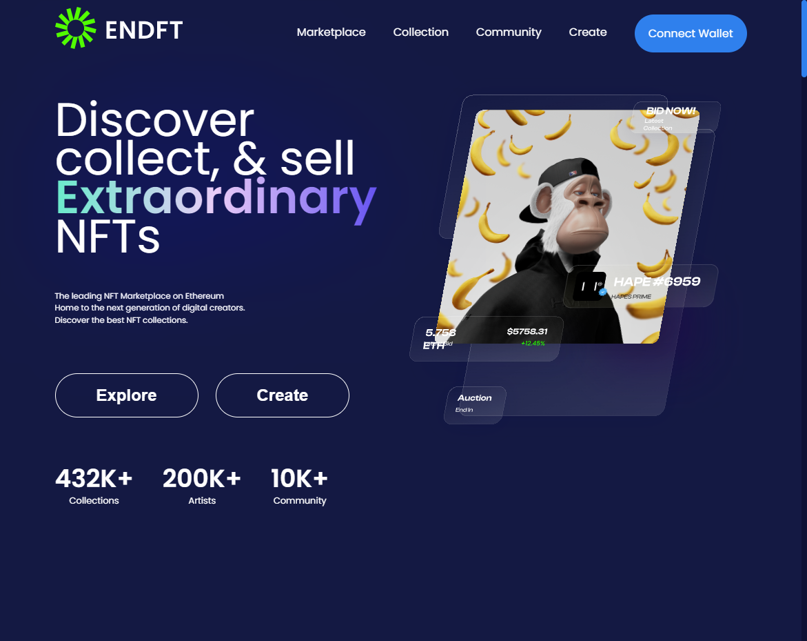

<h1 align="center"> NFT's | MGN </h1>

  <a href="#-tecnologias">Tecnologias</a>&nbsp;&nbsp;&nbsp;|&nbsp;&nbsp;&nbsp;
  <a href="#-projeto">Projeto</a>&nbsp;&nbsp;&nbsp;|&nbsp;&nbsp;&nbsp;
  <a href="#-layout">Layout</a>&nbsp;&nbsp;&nbsp;|&nbsp;&nbsp;&nbsp;
  <a href="#-redes">Redes</a>

---

  

---

## 🚀 Tecnologias

Esse projeto foi desenvolvido com as seguintes tecnologias:

-  HTML
-  CSS
-  JavaScript
-  Swiper JS (Lib)

## 💻 Projeto

O projeto é um desafio aonde de criação de uma landing page sobre NFT. Encontrei o layout na internet e me desafiei a realizar a construção sozinho.
Sendo este estão mais um projeto para adquirir ainda mais conhecimento.

## 🔖 Layout

Você pode visualizar o layout do projeto através [DESSE LINK](<https://www.figma.com/file/QiX6kd7RB5JxpkB89wdUiG/NFT-Marketplace-Landing-Page?node-id=206%3A13513&t=XDbJ2mN3aMSvxL5d-0>).

---

## 🔗 Redes

Estas são minhas redes sociais. Sinta-se a vontade para mandar uma mensagem.

-  [Linkedin](https://www.linkedin.com/in/eomgn/)
-  [Instagram](https://www.instagram.com/matheuzngr/)
-  [Twitter](https://twitter.com/eomgn)
